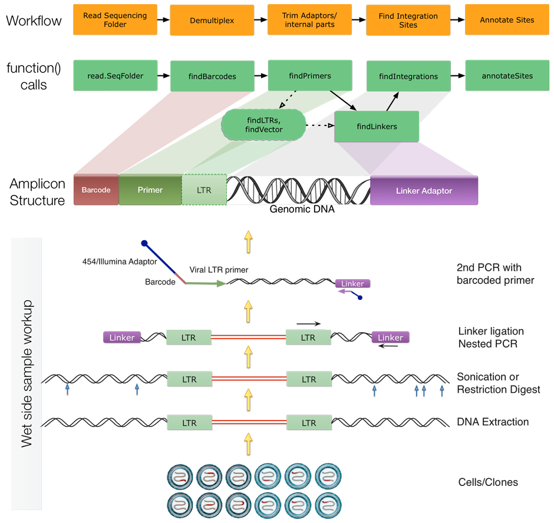
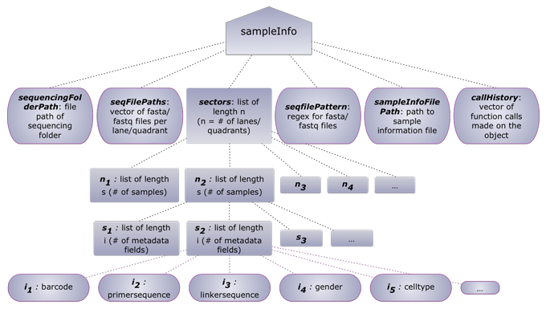

%\VignetteEngine{knitr::knitr}
%\VignetteIndexEntry{Using hiReadsProcessor}

## Introduction
`hiReadsProcessor` contains set of functions which allow users to process LM-PCR products sequenced using any platform. Given an excel/txt file containing parameters for demultiplexing and sample metadata, the functions in here automate trimming of adaptors, removing any vector sequences, and identifying host genomic location.

The basic philosophy of this package is to detect various 'bits' of information in a sequencing read like barcodes, primers, linkers, etc and store it within a nested list in a space efficient manner. No information is duplicated once read into the object and the supplied utility functions enable addition & extraction of needed features on the fly.

Here is the workflow in a nutshell followed by few simple steps to get you started.



Please refer to following publications from [Bushman Lab](http://bushmanlab.org/publications) to obtain more information on sample/amplicon preparation

## Quick *hiReadsProcessor* tutorial.

### Step 1: Loading the tools
First load this package and the parallel backend of choice from `BiocParallel` library. Although `BiocParallel` is imported internally and will invoke `multicore` like functionality, you may have to load it to invoke `snow` like functionality.
```{r, message=FALSE}
library(hiReadsProcessor)
## added to avoid package build failure on windows machines ##
if(.Platform$OS.type == "windows") { register(SerialParam()) }
```

### Step 2: Processing the data
The package comes with an example 454 sequencing run: `FLX_sample_run`. In rest of this tutorial we will use this dataset to introduce functionality of this package.

#### Read the data + metadata files

A typical sequencing run will have several filetypes but among the most important files are the fasta/fastq which are created per sector/quadrant/lane. In the example dataset we have compressed fasta files for three quadrants, an excel spreadsheet holding sample metadata along with information/parameters to process that sample and vector fasta files to be trimmed if needed.

```{r}
runData <- system.file("extdata/FLX_sample_run/", package = "hiReadsProcessor")
list.files(runData, recursive  = TRUE)
```

Function `read.SeqFolder` will initiate a `SimpleList` sample information object which will hold everything regarding the sequencing run. The object is structured to store sequencing file paths, sequence data, processed data as well as sample metadata. The function finds the required file needed to ease the automation process. It is important that somewhere in the sequencing folder there is a file called "sampleInfo" else object initialization will fail.

```{r}
seqProps <- read.SeqFolder(runData, seqfilePattern=".+fna.gz$")
seqProps
```

On successfully initializing the sample information object you will see that there is a hierarchy within the object. The root or top most level holds the information regarding the sequence folder. Each sample within a quadrant/lane is held within "sectors" list. Within the sectors list, there is a list of samples and the associated metadata which gets modified and appended to as the reads get trimmed and aligned.

```{r}
seqProps$sectors$"1"$samples
```

#### Demultiplex reads

The first step of processing most sequencing run is to demultiplex reads by barcodes/MIDs. Function `findBarcodes` automates the demultiplexing process based on already stored data from the sample information file. Please see the documentation for `read.sampleInfo` for the kinds of parameters and information held in a sample information file. An example file is supplied within the `FLX_sample_run` dataset.

```{r}
seqProps <- findBarcodes(seqProps, sector="all", showStats=TRUE)
seqProps
seqProps$sectors
```

#### Detect primers

Following the barcode sequence is the 5' viral LTR primer. Function `findPrimers` facilities the trimming of respective primers(__primerltrsequence__) for each sample. Minimum threshold for detecting the primer can be adjusted using __primerLTRidentity__ within the sample information file.

Since it may take a while to process this kind of data, the package is equipped with processed data object which makes things easier for the tutorial. The code chunks below are not evaluated but rather references the loaded `seqProps` object.

```{r}
load(file.path(system.file("data", package = "hiReadsProcessor"),
               "FLX_seqProps.RData"))
```

```{r, eval=FALSE}
seqProps <- findPrimers(seqProps, showStats=TRUE)
```

#### Detect LTR edge

If LM-PCR products were designed to include the viral LTR (__ltrBitSequence__) following the primer landing site, then `findLTRs` confirms authenticity of the integrated virus. Absence of LTR part denotes nongenuine integration! Minimum threshold for detecting the LTR bit can be adjusted using __ltrBitIdentity__.

```{r, eval=FALSE}
seqProps <- findLTRs(seqProps, showStats=TRUE)
```

#### Detect vector sequence...if any!

If the __vectorFile__ parameter is defined within the sample information file, function `findVector` tags any reads which matches the given vector file. These reads are discarded during the genomic alignment step which is covered later. 

```{r, eval=FALSE}
seqProps <- findVector(seqProps, showStats=TRUE)
```

#### Detect Linker adaptors

Linker adaptors are found on the 3' end of sequences. Depending on an experiment the __linkerSequence__ can be same or different per sample. Furthermore, some linker adaptors are designed to have __*primerID*__ which can help quantify pre-PCR products. Function `findLinkers` makes it easy to process various samples with different linker sequences and type. If primerID technology is utilized, enabling parameter __primerIdInLinker__ within the sample information file automates the extract of the random part within the adaptor. Thresholds for linker detection can be controlled by setting following parameters within the sample information file: __linkerIdentity, primerIdInLinker, primerIdInLinkerIdentity1, primerIdInLinkerIdentity2__

```{r, eval=FALSE}
seqProps <- findLinkers(seqProps, showStats=TRUE, doRC=TRUE)
```

#### Detect integration sites

Once all the non-genomic parts have been detected, it is time to find the actual integration sites. Function `findIntegrations` makes this a breeze given that BLAT and indexed genome files are provided/in-place.

```{r, eval=FALSE}
seqProps <- findIntegrations(seqProps, 
                             genomeIndices=c("hg18"="/usr/local/genomeIndexes/hg18.noRandom.2bit"), numServers=2)
```

#### Obtain summary

Function `sampleSummary` quantifies 7 basic features of this package: 

* decoded: # of reads which found an exact match to the barcode
* primed: # of reads with primer detected after the barcode
* LTRed: # of reads with LTR bit detected after the primer
* vectored: # of reads with vector sequence following the LTR bit
* linkered: # of reads with linker detected
* psl: # of reads with primer, LTR bit, and/or linker which aligned to the genome
* sites: # of unique integration sites (dereplicated by genomic position)

```{r}
sampleSummary(seqProps)
```

## Detailed *hiReadsProcessor* tutorial.

Before diving into functions offered by this package, lets first understand the underlying data object holding all the data. For example purposes we will refer to this as the "sampleInfo" object (although it's essentially a SimpleList object).

The figure below outlines the hierarchy of data storage within the sampleInfo object.


** THE SECTIONS BELOW ARE IN WORKS **
### Sequencing Run related functions
* read.SeqFolder
* read.sampleInfo
* read.seqsFromSector
* findBarcodes|decodeByBarcode
* findPrimers
* findLTRs
* findVector
* findLinkers
* troubleshootLinkers

### Reads related functions
* splitByBarcode
* dereplicateReads
* replicateReads
* splitSeqsToFiles
* write.listedDNAStringSet
* trimSeqs
* removeReadsWithNs

### Alignment functions
* startgfServer
* stopgfServer
* blatSeqs
* blatListedSet
* subreadAlignSeqs
* vpairwiseAlignSeqs
* pairwiseAlignSeqs
* primerIDAlignSeqs

### Alignment related functions
* read.psl
* write.psl
* read.blast8
* read.BAMasPSL
* pairUpAlignments

### Integration Site functions
* findIntegrations
* getIntegrationSites
* clusterSites
* getSonicAbund
* isuSites, otuSites
* crossOverCheck
* annotateSites

### Utility functions
* findAndTrimSeq
* sampleSummary
* pslToRangedObject
* pslCols
* getSectorsForSamples
* extractSeqs
* extractFeature
* doRCtest
* chunkize
* addFeature
* addListNameToReads

## Session Info
```{r}
sessionInfo()
```

